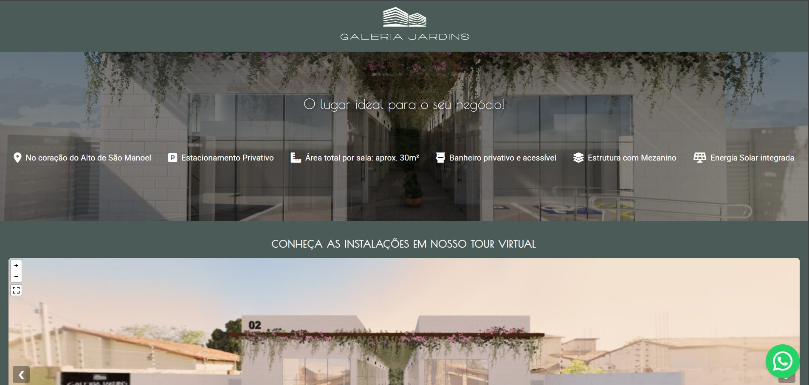

# Galeria Jardins - Website Oficial

Este repositório contém o código-fonte do site da **Galeria Jardins**, um projeto imobiliário para o qual desenvolvi **todo o conceito e execução**, desde a arquitetura até a apresentação digital.

## 🏗️ Sobre o Projeto

Este projeto representa a integração de diversas áreas do meu conhecimento, unindo **arquitetura, modelagem 3D, renderização, tour virtual e desenvolvimento web**. Abaixo, destaco as principais etapas do processo:

### 📐 Arquitetura e Modelagem 3D
- **Projeto arquitetônico** desenvolvido por mim como arquiteta.
- **Modelagem 3D** feita no **SketchUp**.

### 🎨 Renderização e Tour Virtual
- Renders e imagens **360° gerados no Twinmotion**.
- **Tour virtual 360°** implementado no **Pannellum**, utilizando **HTML, CSS e JavaScript**.

### 🌐 Desenvolvimento do Site
- Website criado do zero, utilizando **HTML, CSS e JavaScript**.
- Integração do **tour virtual no site**.
- **Acesse o site:** [Galeria Jardins](https://qrco.de/bflt8t)

### 📌 Identidade Visual e Divulgação
- **Logomarca** desenvolvida no **Brandmark**.
- **Mapa de localização** criado combinando **Google Maps + Canva**.
- **Placa de lançamento imobiliário** desenvolvida no **Canva**.
- **QR Code personalizado** gerado no **GoDaddy**.

## 🚀 Tecnologias Utilizadas
- **SketchUp** (Modelagem 3D)
- **Twinmotion** (Renderizações e imagens 360°)
- **Pannellum** (Tour virtual)
- **HTML, CSS, JavaScript** (Desenvolvimento do site)
- **Brandmark** (Criação da logomarca)
- **Canva** (Edição de imagens e materiais gráficos)
- **Google Maps** (Mapeamento e localização)
- **GoDaddy** (Geração de QR Code personalizado)

## 🎯 Objetivo do Projeto
O principal objetivo deste projeto foi **integrar todas as minhas habilidades aprendidas até o momento**, criando um site que apresenta de forma imersiva e interativa um empreendimento imobiliário.

## 📷 Demonstração

## 📩 Contato
Caso queira saber mais sobre o projeto ou entrar em contato comigo:
## 📩 Contato  
- [LinkedIn](https://www.linkedin.com/in/laranegreiros/)  
- [GitHub](https://github.com/larangrs)  

---
Este projeto é um grande marco na minha jornada profissional, unindo arquitetura e tecnologia para criar experiências inovadoras! ✨

